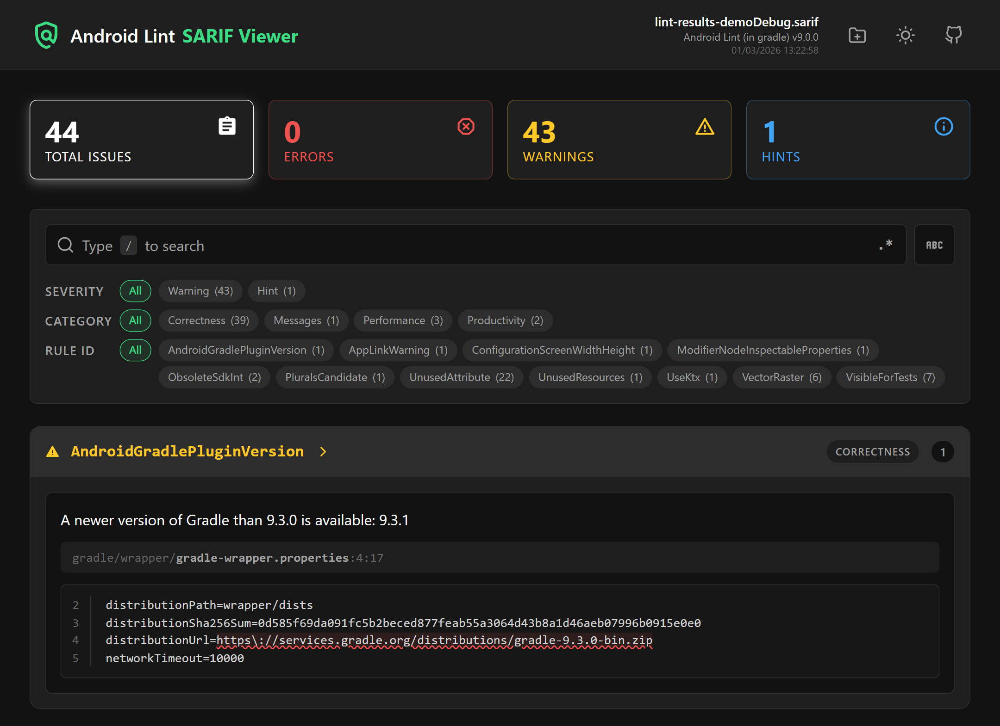
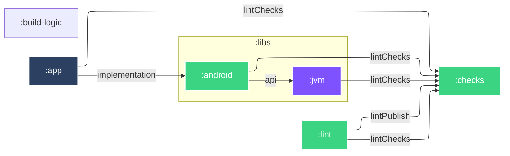

# 🛝 Lint Playground

### [🔍 Android Lint SARIF Viewer](https://simonmarquis.github.io/Lint-Playground/?utm_source=github-readme)

<a href="https://simonmarquis.github.io/Lint-Playground/?utm_source=github-readme">
  <picture>
    <source media="(prefers-color-scheme: dark)" srcset="docs/screenshot-dark.png">
    <source media="(prefers-color-scheme: light)" srcset="docs/screenshot-light.png">
    <!--suppress CheckImageSize -->
    
  </picture>
</a>

- **📦 Zero Dependencies:** Single-file, self-contained, offline-first HTML viewer.
- **🔍 Advanced Filtering:** Filter by severity, category, rule ID, or Regex.
- **⚙️ CI/CD Ready:** Embed report data to generate portable HTML artifacts.
- **💅 Modern UI:** Markdown support and highlighted inline code snippets.


> [!IMPORTANT]
> <details>
> <summary>Why a SARIF Viewer?</summary><br>
>
> Mostly because the official HTML report is broken (it relies on external js/css resources that are 403'ing) since January 2025 and no sign of activity since then on the official issue tracker:
> - [*Android Lint HTML reports broken by code.getmdl.io 403 Forbidden error*](https://issuetracker.google.com/issues/486495092)
> - [*Generated HTML output of lint references JS and CSS that are no longer available (code.getmdl.io)*](https://issuetracker.google.com/issues/474474279)
>
> It also lacks proper search & filter mechanisms that can be very useful to focus on a specific scope.  
> And finally, if we take as an example a 10k issues report:
> - the SARIF file is ~23MB
> - the default HTML report is ~2.3MB but only shows the [50 first instances](https://cs.android.com/android-studio/platform/tools/base/+/mirror-goog-studio-main:lint/cli/src/main/java/com/android/tools/lint/HtmlReporter.kt;l=987?q=MAX_COUNT&sq=&ss=android-studio%2Fplatform%2Ftools%2Fbase) of each issue and omits the rest
> - this new HTML report is ~1.5MB and contains all the reported issues!
> </details>

> [!TIP]
> <details>
> <summary>How to create an embedded HTML report from a SARIF file?</summary><br>
>
> - with a GHA composite action: [`📝 Generate Lint Embedded Reports`](.github/actions/generate-lint-embedded-reports/action.yaml)
>   ```yaml
>   - id: lint
>     run: ./gradlew lint --continue
>   - if: ${{ !cancelled() && contains(fromJSON('["success", "failure"]'), steps.lint.outcome) }}
>     uses: ./.github/actions/generate-lint-embedded-reports
>   ```
> - with a bash script:
>   ```bash
>   (
>     sarif="input.sarif"         # SARIF input file
>     template="docs/index.html"  # HTML template file
>     output="report.html"        # HTML output file
>   
>     {
>       sed -n '1,/<!--region SARIF-EMBEDDED-REPORT-->/p' "$template"
>       printf '<script id="sarif-report" type="application/gzip+base64">'
>       jq -c . "$sarif" | gzip -cn | base64 | tr -d '\n'
>       printf '</script>\n'
>       sed -n '/<!--endregion SARIF-EMBEDDED-REPORT-->/,$p' "$template"
>     } |
>     sed -e '/<!--region REMOVE-IN-EMBEDDED-REPORT-->/,/<!--endregion REMOVE-IN-EMBEDDED-REPORT-->/d' \
>         -e '/\/\/ #region REMOVE-IN-EMBEDDED-REPORT/,/\/\/ #endregion REMOVE-IN-EMBEDDED-REPORT/d' \
>     > "$output"
>   )
>   ```
> </details>

### ▶️ Run configurations

- `🕵️ Lint`: [txt](app/build/reports/lint-results-debug.txt), [xml](app/build/reports/lint-results-debug.xml), [html](app/build/reports/lint-results-debug.html), [sarif](app/build/reports/lint-results-debug.sarif)
- `👷 Build`: [lint-debug.aar](lint/build/outputs/aar/lint-debug.aar), [lint-release.aar](lint/build/outputs/aar/lint-release.aar)
- `🧑‍🔬 Test`: [:app](app/build/reports/tests/testDebugUnitTest/index.html), [:checks](checks/build/reports/tests/test/index.html), [:libs:android](libs/android/build/reports/tests/testDebugUnitTest/index.html)

### 🧮 More info

- [Issue registry](checks/src/main/kotlin/fr/smarquis/playground/lint/IssueRegistry.kt): where issues are registered
- [lint.xml](.config/lint.xml): lint configuration
- [lint-baseline.xml](.config/lint-baseline.xml): lint baseline

### 🏗️  Architecture



### 🔗 Links

- [SARIF specification](https://sarifweb.azurewebsites.net/#Specification)
- [SARIF validator](https://sarifweb.azurewebsites.net/Validation)
- [Android Lint documentation](https://googlesamples.github.io/android-custom-lint-rules/)
- [Android Lint source code](https://cs.android.com/android-studio/platform/tools/base/+/mirror-goog-studio-main:lint/)
