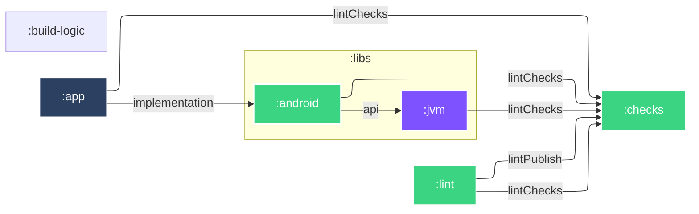

# 🛝 Lint Playground

### [🔍 Android Lint SARIF Viewer](https://simonmarquis.github.io/Lint-Playground/)

### ▶️ Run configurations

- `🕵️ Lint`: [txt](app/build/reports/lint-results-debug.txt), [xml](app/build/reports/lint-results-debug.xml), [html](app/build/reports/lint-results-debug.html), [sarif](app/build/reports/lint-results-debug.sarif)
- `👷 Build`: [lint-debug.aar](lint/build/outputs/aar/lint-debug.aar), [lint-release.aar](lint/build/outputs/aar/lint-release.aar)
- `🧑‍🔬 Test`: [:app](app/build/reports/tests/testDebugUnitTest/index.html), [:checks](checks/build/reports/tests/test/index.html), [:libs:android](libs/android/build/reports/tests/testDebugUnitTest/index.html)

### 🧮 More info

- [Issue registry](checks/src/main/kotlin/fr/smarquis/playground/lint/IssueRegistry.kt): where issues are registered
- [lint.xml](.config/lint.xml): lint configuration
- [lint-baseline.xml](.config/lint-baseline.xml): lint baseline

### 🏗️  Architecture

### 🔗 Links

- https://googlesamples.github.io/android-custom-lint-rules/
- https://cs.android.com/android-studio/platform/tools/base/+/mirror-goog-studio-main:lint/
